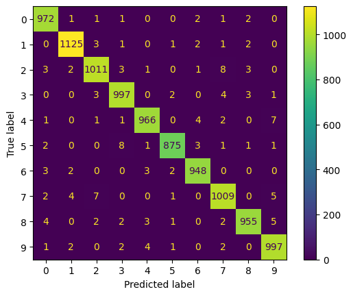

# MNIST Classifier using PyTorch

## Project Overview

This project implements a complete handwritten digit classification pipeline using PyTorch. The model is trained on the MNIST dataset and achieves **98.55% test accuracy** using a fully connected neural network enhanced with Batch Normalization, Dropout, He Initialization, AdamW optimization, learning rate scheduling, model checkpointing, and evaluation metrics.

This project was built to practice the complete deep learning workflow, from data loading and model design to training, evaluation, and performance analysis.

---

## Dataset

MNIST consists of:

* 60,000 training images
* 10,000 test images
* Grayscale handwritten digits
* Image size: 28 × 28 pixels
* 10 classes (digits 0–9)

---

## Model Architecture

```text
Input (784)

↓

Linear(784 → 256)

↓

BatchNorm1d(256)

↓

ReLU

↓

Dropout(0.3)

↓

Linear(256 → 128)

↓

BatchNorm1d(128)

↓

ReLU

↓

Dropout(0.3)

↓

Linear(128 → 10)

↓

Logits
```

### Techniques Used

* Batch Normalization
* Dropout Regularization
* He (Kaiming) Initialization
* AdamW Optimizer
* ReduceLROnPlateau Scheduler
* Model Checkpointing

---

## Training Configuration

| Parameter     | Value             |
| ------------- | ----------------- |
| Epochs        | 20                |
| Batch Size    | 64                |
| Optimizer     | AdamW             |
| Learning Rate | 0.001             |
| Weight Decay  | 1e-4              |
| Loss Function | CrossEntropyLoss  |
| Scheduler     | ReduceLROnPlateau |

---

## Results

### Final Test Accuracy

```text
98.55%
```

### Classification Report

```text
Precision, Recall and F1-score above 0.98 for all classes.
```

### Confusion Matrix


The confusion matrix visualizes model predictions across all digit classes.

### Key Observations

- Test Accuracy: **98.55%**
- Most predictions lie on the diagonal, indicating correct classifications.
- The model performs exceptionally well across all digits with precision and recall above 0.98.
- A small number of errors occur between visually similar handwritten digits.


---

## Project Structure

```text
mnist_classifier/
│
├── model.py
├── train.py
├── evaluate.py
├── confusion_matrix.png
├── requirements.txt
├── README.md
└── .gitignore
```

---

## Concepts Practiced

### Neural Networks

* Forward Pass
* Backpropagation
* Gradient Descent
* Computational Graphs
* Autograd

### Activation Functions

* ReLU
* Softmax (via CrossEntropyLoss)

### Regularization

* Dropout
* Weight Decay (L2 Regularization)

### Normalization

* Batch Normalization

### Initialization

* He (Kaiming) Initialization

### Training Pipeline

* Dataset
* DataLoader
* Training Loop
* Validation Loop
* Evaluation Mode
* No Gradient Inference

### Optimization

* AdamW
* Learning Rate Scheduling

### Evaluation

* Accuracy
* Classification Report
* Confusion Matrix

---

## Key Learnings

* Why BatchNorm stabilizes training.
* How Dropout reduces overfitting.
* Why He initialization is preferred for ReLU networks.
* How CrossEntropyLoss handles Softmax internally.
* How to build complete train/evaluate pipelines in PyTorch.
* How checkpointing saves the best-performing model.
* How confusion matrices reveal model weaknesses.

---

## Future Improvements

* Convolutional Neural Networks (CNNs)
* Data Augmentation
* Early Stopping
* Hyperparameter Tuning
* TensorBoard Integration
* MLflow Experiment Tracking

---

## Author

Built as part of a Deep Learning learning journey focused on understanding neural networks from first principles and implementing complete training systems in PyTorch.
